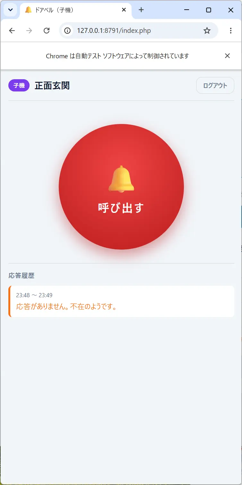
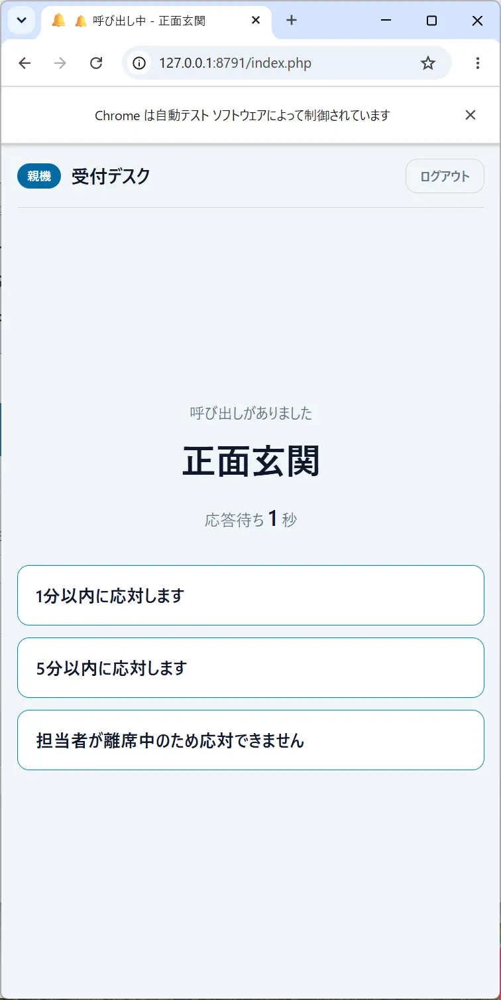

# 簡易ドアベルシステム

親機・子機のどちらも Web ブラウザだけで動作する、ポーリング方式の簡易ドアベルです。
子機（玄関・受付窓口など）のコールボタンを押すと親機（担当者の PC やタブレット）で
呼び出し音が鳴り、親機で選んだ応答メッセージが子機に表示されます。

- サーバー: PHP 8.4 以上（PDO SQLite 拡張が必要）
- データベース: SQLite（PDO）
- クライアント: HTML5 + JavaScript（PC / タブレット / スマートフォン）
- 追加ライブラリ・ビルドツール: なし

## ディレクトリ構成

```
web-doorbell/
├── public/              ← ドキュメントルートに設定する
│   ├── index.php        メイン画面（ログイン / 親機 / 子機）
│   ├── api.php          ポーリング・呼び出し・応答の API
│   ├── admin.php        ID発行管理画面
│   └── assets/
│       ├── app.js       画面制御・ポーリング・リングトーン生成
│       └── style.css
├── config/              ← Web から読めない場所に置く
│   ├── config.php       設定ファイル（実際に使われるもの）
│   ├── config.sample.php
│   └── .htaccess        直接アクセス拒否
├── src/                 ← Web から読めない場所に置く
│   ├── bootstrap.php    共通初期化・オートローダ
│   ├── Config.php       設定の読み込み
│   ├── Database.php     SQLite 接続とスキーマ作成
│   ├── Doorbell.php     ID発行・ログイン・呼び出し・応答のロジック
│   ├── Http.php         セッション / JSON / IP取得 / レート制限
│   └── .htaccess        直接アクセス拒否
├── data/                ← SQLite ファイルの置き場所（要書き込み権限）
│   └── .htaccess        直接アクセス拒否
├── tests/               ← テスト（後述）
├── .htaccess            ドキュメントルートを変更できない環境向けの保険
└── README.md
```

`config` / `src` / `data` は公開ディレクトリの外にあります。
**ドキュメントルートは必ず `public/` に設定してください。**

## セットアップ

1. 設定ファイルを用意します（同梱の `config/config.php` をそのまま使うこともできます）。

   ```
   cp config/config.sample.php config/config.php
   ```

2. `config/config.php` の `admin_password` を必ず変更してください（初期値は `1234`）。
3. `data/` ディレクトリに Web サーバー実行ユーザーの書き込み権限を与えます。
   データベースファイルは初回アクセス時に自動作成されます。

### 動作確認（PHP ビルトインサーバー）

```
php -S 0.0.0.0:8000 -t public
```

- メイン画面: `http://<サーバー>:8000/`
- ID発行管理画面: `http://<サーバー>:8000/admin.php`

> **注意:** 親機と子機は、同じブラウザプロファイルでは同時にログインできません。
> ログイン状態をセッション Cookie で保持しているため、後からログインしたほうで上書きされます。
> 1台の PC で両方の画面を同時に開いて動作確認したい場合は、
> 別のブラウザ、シークレット/プライベートウィンドウ、別のブラウザプロファイルを使ってください。
> （実運用では親機と子機は別の端末で使うため問題になりません）

### Apache

```apache
<VirtualHost *:80>
    DocumentRoot /path/to/web-doorbell/public
    <Directory /path/to/web-doorbell/public>
        AllowOverride All
        Require all granted
    </Directory>
</VirtualHost>
```

ドキュメントルートを `public/` に変更できないレンタルサーバー等では、
リポジトリ直下の `.htaccess`（`config` / `data` / `src` を遮断し `public/` へ転送）をそのまま使ってください。

### nginx + php-fpm

```nginx
server {
    listen 80;
    server_name doorbell.example.com;
    root /path/to/web-doorbell/public;
    index index.php;

    location / {
        try_files $uri $uri/ /index.php;
    }

    location ~ \.php$ {
        include fastcgi_params;
        fastcgi_param SCRIPT_FILENAME $document_root$fastcgi_script_name;
        fastcgi_pass unix:/run/php/php8.4-fpm.sock;
    }
}
```

## 使い方

### 1. ID を発行する

`admin.php` にアクセスし、管理パスワード（初期値 `1234`）でログインして
「新しいIDを発行する」を押します。**ID・親機用パスワード・子機用パスワード**が
表示されるので控えてください。パスワードはハッシュ化して保存されるため再表示できません。

### 2. 親機・子機からログインする

メイン画面で ID・パスワード・表示名を入力します。
入力されたパスワードが親機用か子機用かで、**役割が自動的に判定されます**。

| 画面 | 内容 |
| --- | --- |
| 親機 | 「待ち受け中」と応答履歴を表示し、設定間隔でポーリング。呼び出しがあると子機の表示名を表示してリングトーンを鳴らし、3種類の応答ボタンを表示します。 |
| 子機 | 大きなコールボタンと応答履歴を表示。押すとリングトーンを鳴らして親機を呼び出し、応答があると親機の表示名とメッセージを表示します。 |

- 親機が応答しないまま**不在判定秒数**（既定 60 秒）が経過すると、
  子機に「応答がありません。不在のようです。」が表示されます。
- 子機は応答表示から 60 秒経過するか「TOPに戻る」を押すとコール画面に戻ります。
- 親機のポーリングが**5回分**確認できない場合、子機に「親機の電源が入っていないようです」を表示します。
- 応答待ちの間に何度コールボタンを押しても呼び出しは 1 件にまとめられ、
  履歴では同じ子機からの連続した「応答なし」もまとめて表示されます。

 

### 応答履歴

親機・子機の双方に応答履歴を表示します。見逃した呼び出し（応答なし）はオレンジ、
応答済みは緑で色分けされ、決着した時刻の新しい順に並びます。

- **親機**: そのIDに属する全ての子機の呼び出しを、呼び出し元の子機名つきで表示します。
  待ち受け画面に出るので、席を外している間に来た呼び出しを後から確認できます。
  応答しないまま終了した呼び出しがあると「応答がないまま終了した呼び出しがあります」と表示します。
- **子機**: 自分が行った呼び出しのみを表示します。

### 子機の稼働状態（親機の待ち受け画面）

親機の待ち受け画面に、その ID の子機の状態を表示します。
子機のネットワークが切れたまま気づかない、といった状況を発見するためのものです。

| 表示 | 意味 |
| --- | --- |
| 🟢 オンライン | ポーリングが `polling_interval × parent_offline_polls`（既定 50 秒）以内に届いている |
| 🔴 オフライン（最終応答 00:00） | ポーリングが途絶えた。最後に応答した時刻を併記する |
| 「稼働中の子機がありません」 | 表示対象の子機が1台もない |

**ログアウトした子機は一覧から消え、通信が途絶えただけの子機はオフラインとして残ります。**
オフライン表示を続ける時間は `child_status_window`（既定 1 時間）で変更できます。

### サーバーに接続できないとき

ポーリングに失敗している間は「サーバーに接続できません（○分○秒）。再試行しています…」を表示して
再試行を続けます。この状態が `offline_stop_seconds`（既定 10 分）続くと、
**エラーを全画面で表示してポーリングを停止します。**

古い画面のまま動き続けて「待ち受け中に見えるのに実際は呼び出しを受け取れていない」状態を
避けるためです。復旧したら「再接続する」ボタンで通信を再開できます。

### 複数の子機から同時に呼び出された場合（親機の画面）

`max_children_per_id` を 2 台以上にすると、複数の子機が同時に呼び出す場合があります。
親機の画面は呼び出しの件数に応じて切り替わります。

| 件数 | 表示 |
| --- | --- |
| 1件 | 従来どおり、子機名を大きく表示し、応答メッセージ全文のボタンを縦に並べます。 |
| 2件以上 | 呼び出しごとにカードを並べ、各カードに子機名・呼び出し回数・残り秒数と短縮ラベルの応答ボタン（「1分以内」「5分以内」「離席中」）を表示します。 |

カードは**残り時間の短い順（＝呼び出しが古い順）に上から並び、新しい呼び出しは末尾に追加**されます。
応答ボタンを押そうとしている最中に並びがずれて誤タップすることを防ぐためです。
残り 10 秒を切ったカードは赤く強調されます。

タブ切り替えやキューイング（1件ずつ表示）ではなくこの方式を採っているのは、
呼び出しごとに独立した不在判定タイマーが動いているため、
**表示されていない呼び出しの残り時間が分からない状態を作らない**ことを優先したからです。

一部の呼び出しにだけ応答した場合は、残りの呼び出しを隠さないよう、
送信結果を画面上部に短時間だけ表示します（全件に応答し終えると全画面で確認できます）。

## 設定項目（`config/config.php`）

| キー | 既定値 | 説明 |
| --- | --- | --- |
| `polling_interval` | 10 | ポーリング間隔（秒） |
| `admin_password` | `'1234'` | ID発行画面のパスワード |
| `admin_session_lifetime` | 1800 | ID発行画面のログインが失効するまでの無操作時間（秒） |
| `max_ids_per_instance` | 100 | サーバー1インスタンスあたりの最大ID数 |
| `max_children_per_id` | 1 | 1IDあたりの最大子機数（2以上にすると親機は複数呼び出しをカードで並べて表示） |
| `max_parents_per_id` | 1 | 1IDあたりの最大親機数 |
| `max_ids_per_ip` | 5 | 1IPあたりの最大ID数（発行時のIPと親機稼働中のIPで判定） |
| `ringtone_repeat` | 3 | リングトーン再生リピート回数 |
| `absence_timeout` | 60 | 不在判定秒数 |
| `db_path` | `data/doorbell.sqlite` | SQLite ファイルの場所 |
| `response_view_timeout` | 60 | 子機が応答表示からコール画面へ自動で戻るまでの秒数 |
| `parent_offline_polls` | 5 | 親機オフラインと判定するまでのポーリング回数 |
| `offline_stop_seconds` | 600 | サーバーに接続できない状態がこの秒数続いたらポーリングを停止する |
| `child_status_window` | 3600 | 親機の待ち受け画面に、通信が途絶えた子機をオフラインとして表示し続ける秒数 |
| `session_lifetime` | 86400 | 端末セッションの有効期間（秒） |
| `history_retention_days` | 30 | 呼び出し履歴の保持日数 |
| `history_display_limit` | 20 | 子機に表示する履歴の件数 |
| `trust_proxy` | false | `X-Forwarded-For` を信頼するか（プロキシ配下のみ true に） |
| `rate_limit` | — | IP単位のレート制限（後述） |

## 実装上の仕様

### 役割と端末の識別

- ログイン後の認証状態は PHP セッション（HttpOnly / SameSite=Lax Cookie）で保持します。
- ブラウザは `localStorage` に**端末キー**を保存し、ログイン時に送信します。
  これにより再ログインしても同じ端末として扱われ、子機の履歴が引き継がれます。
- 端末キーはブラウザ側の値なので、それだけでは同時接続数の上限を守れません。
  ログインのたびにサーバーが**セッション鍵**を発行し直し、1台の端末につき有効なセッションを
  1つに限定しています。同じ端末で入り直すと、前のセッションは自動的にログアウトします。
- 「稼働中」の判定は `polling_interval × parent_offline_polls`（既定 50 秒）以内に
  ポーリングがあったかどうかで行います。ログアウトすると即座に枠が解放されます。

### リングトーン

音源ファイルは使わず、Web Audio API でチャイム音を合成しています。
ブラウザの自動再生制限に対応するため、ログインボタン押下（ユーザー操作）の中で
AudioContext を初期化します。対応端末ではバイブレーションも併用します。

### データベース

| テーブル | 用途 |
| --- | --- |
| `doorbell_ids` | 発行済みID、親機/子機パスワードのハッシュ、発行元IP |
| `devices` | ログイン中の端末（役割・表示名・IP・最終ポーリング時刻） |
| `calls` | 呼び出しと応答（状態・呼び出し回数・応答メッセージ） |
| `rate_limits` | レート制限のカウンタ |

古い履歴（既定 30 日）と長期間アクセスのない端末は、アクセス時にまれに実行される
クリーンアップ処理で自動削除されます。cron の設定は不要です。

## テスト

```bash
bash tests/run.sh          # 構文チェック + 全テスト
php  tests/logic_test.php  # ロジックのみ（32件）
bash tests/e2e_test.sh     # HTTP経由の統合テストのみ（33件）
```

| ファイル | 内容 |
| --- | --- |
| `tests/logic_test.php` | 不在判定、履歴のまとめ、同時コール、子機の稼働状態、各種上限、IDの正規化 |
| `tests/e2e_test.sh` | ID発行 → 親機/子機ログイン → 呼び出し → 応答までを HTTP 経由で検証。CSRF・権限・非公開ファイルの秘匿も確認 |

どちらも**一時ファイルの SQLite を使うため、`data/` の実データには影響しません**
（`e2e_test.sh` は専用のテストサーバーを自動で起動・停止します）。
DB の場所は環境変数 `DOORBELL_DB_PATH` で上書きできます
（CLI と組み込みサーバー専用。php-fpm 等の本番環境では無視されます）。

すでに動作しているサーバーに対して統合テストを実行することもできます。
この場合はそのサーバーのデータに ID が追加される点に注意してください。

```bash
BASE_URL=http://127.0.0.1:8000 bash tests/e2e_test.sh
```

## セキュリティと DoS 対策

実装済みの対策:

- 設定ファイル・DB・ソースを公開ディレクトリの外に配置し、`.htaccess` でも直接アクセスを拒否
- SQLite ファイルは所有者だけが読めるパーミッション（`0600`）に調整（POSIX 環境のみ）
- パスワードは `password_hash()` でハッシュ化して保存
- 全ての状態変更操作に CSRF トークンを要求、ログイン成功時にセッションIDを再生成
- IP単位のレート制限（既定: API 300回/分、ログイン試行 10回/分、コール 20回/分）。
  ログイン試行の枠はメイン画面と ID発行画面で別々に数えます
- ID・パスワードの誤りによるログイン失敗時は、IDの存在有無を推測されないよう
  **エラー内容と応答時間の両方**を揃える
- ID発行数の上限（サーバー全体 / IP単位）と同時接続端末数の上限
- ID発行画面のログインは無操作が `admin_session_lifetime` 続くと失効
- 応答メッセージはサーバー側の定義のみを受け付ける（クライアントから任意の文字列を送れない）
- 出力は全てエスケープ（PHP側は `htmlspecialchars`、JS側は `textContent`）

追加で検討する場合:

- **Basic 認証**: 不特定多数に公開する必要がなければ、システム全体に Basic 認証を掛けるのが
  最も確実です（Apache なら `public/.htaccess` に `AuthType Basic` を追加）。
  ただし、子機を来訪者に操作させる用途では運用が難しくなる点に注意してください。
- **HTTPS 必須化**: パスワードを平文で送らないよう、公開運用では TLS を必須にしてください。
  HTTPS 環境では Cookie に自動的に `Secure` 属性が付きます。
- **リバースプロキシでの制限**: nginx の `limit_req` / Cloudflare 等での追加制限。
- `polling_interval` を大きくすると、同時接続端末が増えたときのサーバー負荷を下げられます。

## 今回実装していない項目（将来拡張？）

- コールボタン押下時に Web カメラで撮影した画像を送信
- ボイスメッセージの録音・再生
